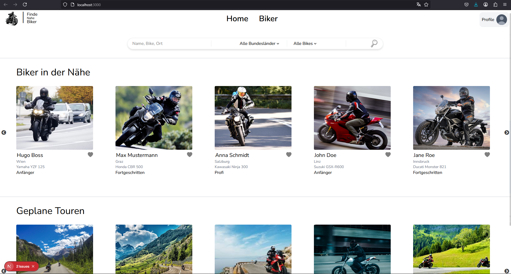

=======
# 🏍️ BikeTndr

BikeTndr ist eine **Next.js**-App, die Motorradfahrer miteinander verbindet! 🏍️🔥 Die Plattform ermöglicht es Nutzern, andere Biker in der Nähe zu finden, geplante Routen zu entdecken und eine starke Community aufzubauen.

---

## 🚀 Funktionen
- 🔍 **Biker in der Nähe finden** – Suche nach Fahrern basierend auf Standort, Erfahrungslevel und Motorradmodell.
- 🗺️ **Routen entdecken** – Finde geplante Touren und schließe dich spannenden Fahrten an.
- ❤️ **Mit anderen verbinden** – Speichere deine Lieblingsprofile und interagiere mit der Community.
- 🌍 **Filter & Suche** – Verfeinere deine Suche nach Bundesland, Motorradtyp und mehr.

---

## 🛠️ Tech-Stack
- **Next.js** – Für serverseitiges Rendering und optimierte Performance.
- **React** – Für dynamische UI-Komponenten.
- **Tailwind CSS** – Für ein modernes und responsives Design.
- **Turbopack** – Für gutes bundling.

---

## 📸 Screenshots


---

## 📦 Installation & Setup
```bash
# Repository klonen
git clone https://github.com/deinbenutzername/biketndr.git
cd biketndr

# Abhängigkeiten installieren
npm install

# Entwicklungsserver starten
npm run dev

# Im Browser öffnen
http://localhost:3000
```

---

## 🎯 Roadmap
- 📍 Echtzeit-Chat-Funktion hinzufügen.
- 🚦 Live-Standortverfolgung für Biker integrieren.
- 🏆 Erfolge & Abzeichen für aktive Nutzer einführen.

---

## 🤝 Mitwirken
Beiträge sind willkommen! Forke das Repository, erstelle einen Branch und sende eine Pull-Request. 🚀

---

## 📜 Lizenz
Dieses Projekt steht unter der MIT-Lizenz.

---

Fahr sicher & bleib verbunden! 🏍️💨
